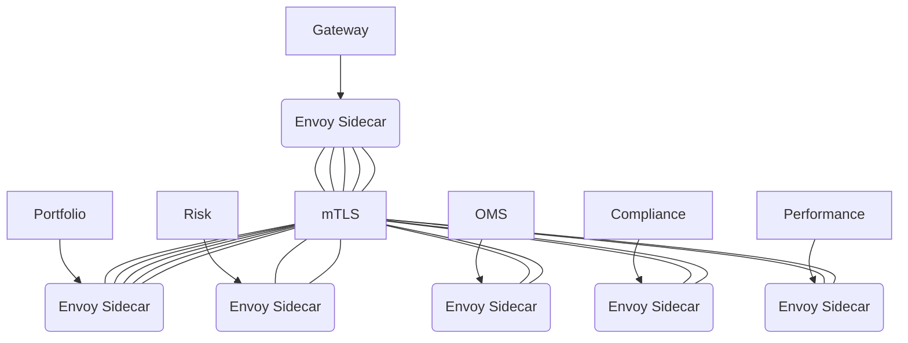
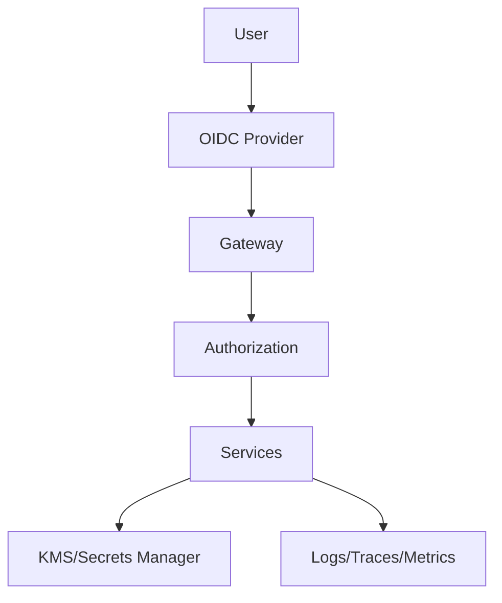

# Aegis-IMX Architecture Specification

## Data Flow
```mermaid
graph LR
    subgraph Ingestion
        Source1[Market Data]\n        Source2[Orders]
    end
    Source1 -->|stream| Raw
    Source2 -->|batch| Raw
    subgraph Lakehouse
        Raw --> Bronze --> Silver --> Gold
    end
    Gold --> Portfolio
    Gold --> Risk
    Gold --> OMS
    Gold --> Compliance
    Gold --> Performance
    Portfolio -->|events| EventBus((Kafka/Redpanda))
    Risk -->|events| EventBus
    OMS -->|events| EventBus
    Compliance -->|events| EventBus
    Performance -->|events| EventBus
    EventBus --> Batch["Spark Jobs"]
    EventBus --> Stream["Flink Streams"]
    subgraph UI
        Portal[Next.js]
    end
    Portal --> API
    subgraph Gateway
        API[GraphQL/REST]
    end
    API --> Portfolio
    API --> Risk
    API --> OMS
    API --> Compliance
    API --> Performance
```

## Service Mesh


## Zero-Trust Network


## Core Domain Services
- Portfolio Service
- Risk Service
- OMS/EMS Service
- Compliance Service
- Performance Service

## Shared Services
- Identity & Access (OIDC)
- Authorization (OPA)
- Secrets Management (KMS/Hashicorp Vault)
- Observability (Prometheus/Grafana/ELK)

## API Boundaries
- API Gateway exposes GraphQL and REST endpoints.
- Async communication via Kafka/Redpanda event bus.

## Data Processing
- Batch processing with Spark.
- Stream processing with Flink.

## Non-Functional Requirements
- **Scalability SLOs:** Throughput ≥ 10k TPS; latency p95 ≤ 100ms, p99 ≤ 200ms.
- **High Availability / Disaster Recovery:** RPO ≤ 5 minutes; RTO ≤ 30 minutes; multi-AZ deployment.
- **Security:** mTLS for service mesh; JWT/OIDC for authentication; fine-grained ABAC with OPA/Rego; KMS envelope encryption.

## API Versioning & Compatibility
- Semantic versioning (MAJOR.MINOR.PATCH).
- Backward-compatible changes allowed in MINOR releases; breaking changes require new MAJOR version and coexistence period.

## Threat Model
- **Assets:** Market data, trade orders, portfolio holdings, user credentials.
- **Actors:** Internal users, external clients, malicious attackers, rogue insiders.
- **Entry Points:** API Gateway, event bus, data ingestion endpoints.
- **Mitigations:** mTLS, OIDC, OPA policies, WAF, encryption at rest/in transit, least privilege.

## Data Classification
| Data Type | Classification | Handling |
|-----------|---------------|---------|
| Market Data | Public | Encrypted in transit |
| Trade Orders | Confidential | Encrypted at rest and in transit |
| Portfolio Holdings | Restricted | Tokenized, least privilege |
| User Credentials | Sensitive | Hashed, encrypted, MFA |

## Cost Model & Scale-Up Path
- Start with single region, auto-scaling node pools.
- Optimize storage costs via tiered S3 buckets (raw/bronze/silver/gold).
- Scale compute via Kubernetes HPA and Spark/Flink auto-scaling.
- Leverage spot instances for batch workloads.
